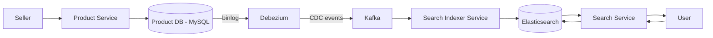
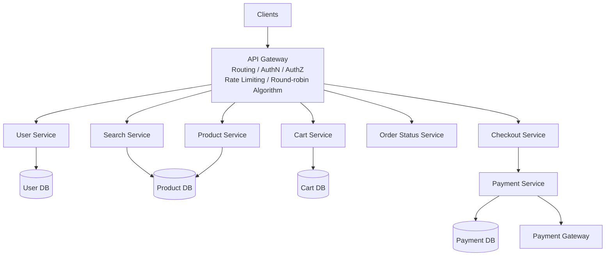
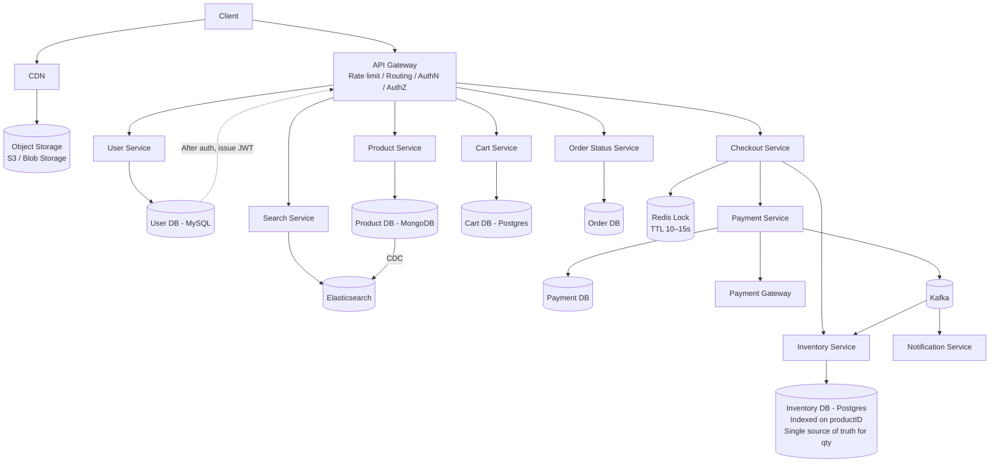
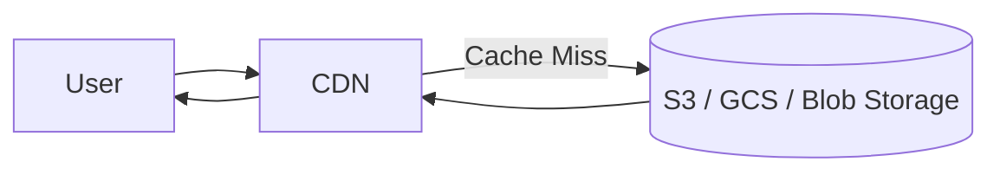

# E-Commerce Platform System Design (like Amazon, Flipkart)


## 1. Functional Requirements

- User should be able to **search and find** a product based on product title or names.
- User should be able to **view the details** of the product (description, image, available quantity, reviews).
- User should be able to **place the item in cart** — select the quantity and add/remove the item.
- User should be able to **make the payment** and do the checkout.
- User should be able to **check the status** of the order.
- **Manage purchase of items** having limited stock.

---

## 2. Non-Functional Requirements

- **Scale:** 10M DAU, 10 orders/sec.
- **CAP:** Highly available with respect to searching and viewing the items, and highly consistent with respect to placing the order & payment.
- **Latency:** ~200 ms.

> 💡 *Note: this is a classic AP-for-read-path / CP-for-write-path split — browse & search favor availability, checkout & payment favor consistency.*

---

## 3. Core Entities

- User
- Product
- Order
- Cart
- Checkout

---

## 4. API Design

### 1. Search
```
GET /v1/product/search?q={searchText}
```
→ Returns: `List<ProductID (Partial)>` — **paginated**.

### 2. Get Product Details
```
GET /v1/product/{productId}
```
→ Returns the product details (JSON).

### 3. Add to Cart
```
POST /v1/cart/add
Body: { all product IDs }
```
- `guest add` would go in **header** to add item in cart (i.e. for guest users, cart identity travels via header, not body).
- Returns: `cartId`.

### 4. Checkout
```
POST /v1/checkout
Body: { all product IDs, with qty & price }
```
→ Returns: `orderId`.

### 5. Payment
```
POST /v1/payment
Body: { orderId, payment details }
```
→ Updates and returns: `payment details` → **confirmation**.

### 6. Order Status
```
GET /v1/status/{orderId}
```

---

## 5. Search — Deep Dive

**Problem:** Millions of records/data are stored in the Product DB, so simply searching in the DB from top to bottom is not a good approach.
We can add indexing, but the DB operation will still be time consuming.

### ✅ Optimal Approach
Add a **CDC (Change Data Capture)** pipeline + **Elasticsearch**.

Whenever a product is updated:
1. CDC captures the transaction logs (via **Debezium**).
2. Publishes the change event to **Kafka**.
3. The **Indexer Service** transforms it into a search-document format.
4. Indexer ingests it into **Elasticsearch**.

### Flow



### What does Elasticsearch do?

- **Typo tolerance** — e.g. `iphon`, `i phone` → still matches `iPhone`.
- **Fuzzy matching** — e.g. `sum ung` → `Samsung`.
- **Synonyms** — e.g. `mobile` → `iPhone`, `smartphone`, `cellphone`.
- Products with better rating / higher sale volume come first (ranking).

---

## 6. Cart, Checkout & Kafka — Deep Dive

- **Cart DB won't store price** of the product, because price varies with time.
- **Need of Kafka:** In the payment stage, after checkout you do payment → update payment DB → then update inventory DB to reduce qty count → then update order DB with order status.
  - Since there are a lot of concurrent/consequent operations happening, it will affect the **consistency** and **idempotency** of the system.

```
Inventory DB → Product DB
   Kafka call or CDC call or cron job → to update qty.
```

> 💡 *In other words: use Kafka (event-driven, async) instead of a synchronous chain of DB calls, so a failure in one step doesn't leave the system in a half-updated state — and consumers can retry safely without double-processing (idempotency).*

---

## 7. High-Level Design (HLD)

> 💡 *Redrawn HLD:*



---

## 8. Low-Level Design (LLD)

### Entity field notes (from the sketch)

**User DB (MySQL)**
- name, email, password, mobile, address(es)

**Product DB**
- productID
- name
- description
- category
- price
- image URL(s)
- currency

**Cart DB (Postgres — "CART")**
- cartID
- userID
- productID(s)
- ⇒ productID, quantity

**Order DB**
- orderID
- userID
- items (productID, qty), currency
- total
- paymentID
- status

**Inventory DB (Postgres, indexed on productID)**
- productID, quantity — **single source of truth for quantity**

### Note on race conditions (from the sketch)

> To avoid race condition, apply Redis lock on Inventory. While concurrently checking and sharing, cart contention occurs.
> **TTL → 10-15 sec**

> 💡 *Redrawn LLD:*



---

## 9. Consolidated Notes / Clarifications 💡

These are additive — nothing above was removed, this section just restates a few
things in plain language for quick review:

1. **Why Kafka + CDC for search:** avoids scanning millions of rows on every query; keeps Elasticsearch eventually-consistent with the source-of-truth Product DB without the app explicitly writing to two places.
2. **Why price isn't stored in Cart DB:** price is time-varying (discounts, flash sales) — always fetch live price at checkout, not at add-to-cart time.
3. **Why Redis lock on inventory:** prevents two concurrent checkouts from overselling the same last unit of stock; short TTL (10–15s) so a crashed request doesn't hold the lock forever.
4. **Why Kafka between Payment → Inventory → Order:** decouples the multi-step "payment succeeded → reduce stock → update order status" chain so a failure in one step is retryable/async instead of a fragile synchronous call chain — directly protects consistency & idempotency, which the notes flag as the risk.
5. **JWT from User Service:** issued after authentication and required by all subsequent authenticated calls through the gateway.

What does CDN do?

